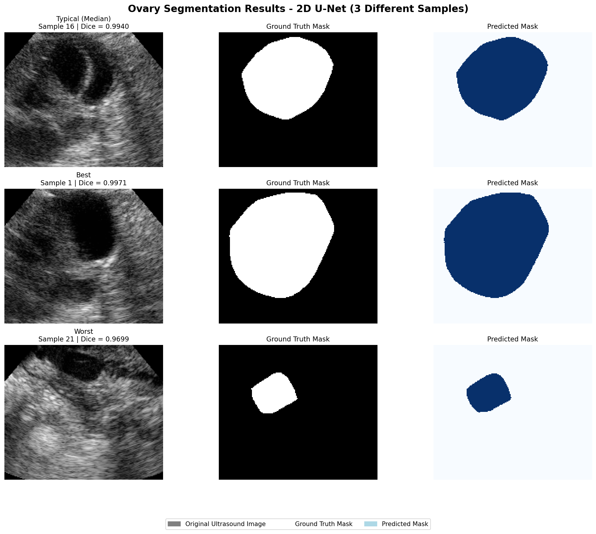

# Ovary Ultrasound Image Segmentation

> 基于 U-Net 的卵巢超声图像自动分割系统

## 项目简介

本项目使用 2D U-Net 模型对卵巢超声图像进行自动分割，用于辅助生殖医学中的卵巢体积测量和功能评估。

- **数据集**: USOVA3D (3D 卵巢超声)
- **模型**: 2D U-Net
- **评估指标**: Dice Coefficient = 0.9899

## 项目结构

```
ovary_segmentation_project/
├── src/
│   ├── model.py          # U-Net 模型定义
│   ├── data_loader.py    # 数据加载模块
│   └── train.py          # 训练脚本
├── results/              # 可视化结果
├── models/               # 训练好的模型权重
└── README.md             # 项目说明
```

## 快速开始

### 环境要求
- Python 3.8+
- PyTorch 1.10+
- numpy, matplotlib, tqdm

### 数据准备
1. 下载 USOVA3D 数据集
2. 将数据转换为 npy 格式

### 训练模型
```bash
python src/train.py
```

## 实验结果

| 指标 | 数值 |
|------|------|
| 平均 Dice | 0.9899 |
| 最佳 Dice | 0.9971 |
| 最差 Dice | 0.9699 |

## 可视化结果

### 训练曲线


### 预测结果对比


上图中，从左到右依次为：原始超声图像、真实掩码、模型预测掩码。绿色和红色区域分别表示卵巢和卵泡的预测结果。

## 临床意义

- 自动分割卵巢区域，辅助计算卵巢体积
- 为卵泡计数和发育监测提供基础
- 提高生殖医学影像分析的效率和一致性

## 参考文献

- USOVA3D Dataset: https://usova3d.um.si/
- U-Net: Ronneberger et al., MICCAI 2015

## 联系方式

- 作者：胡静怡
- 邮箱：HJY_academic@outlook.com
